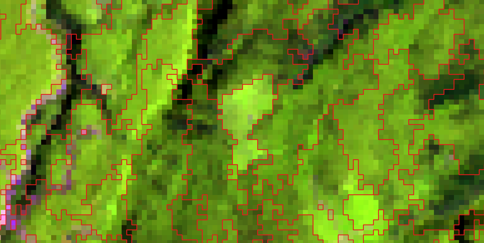
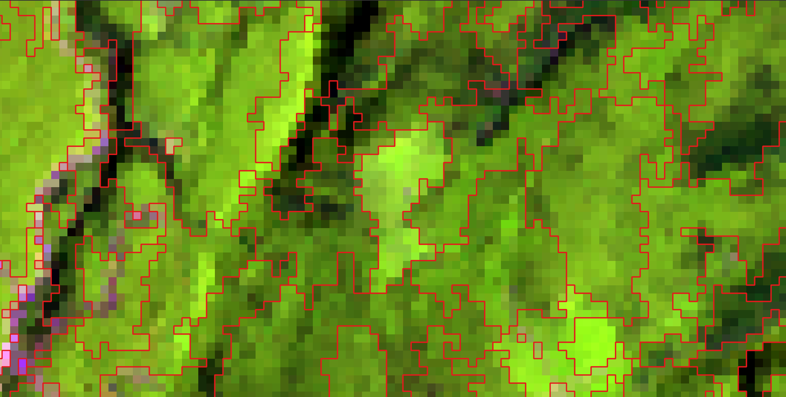

# fast_segment

[](https://github.com/Sugarc0de/fast_segment/actions/workflows/ci.yml)

Multi-resolution region-growing segmentation for raster imagery, in Rust.

It implements the algorithm from Ye et al. (2025), which extends Harward and
Woodcock's 1992 segmenter to take a **second data layer**. The original grows
regions in one image and then forces the undersized ones to merge with whatever
is nearest. The modification keeps that first stage as a micro-segmentation, and
replaces the second with one that develops those micro-segments against a
different image over the same grid — forest structure, age, species, anything on
the same pixels.

|  |  |
|:--:|:--:|
| second layer: stand **age** | second layer: canopy height (**`elev_p95`**) |

*One Landsat scene, one phase 1, two second images. Phase 1 micro-segments the
spectral proxies; phase 2 develops those micro-segments against the layer you
give it, and the stands it draws are not the same ones.*

The original algorithm is still in here and still exact. With one image the
program does what the 1992 C did, byte for byte. The second layer is an option,
not a fork, so both papers' methods run from the same binary.

It also handles images the C cannot — it segfaults above roughly 5000 × 5000 —
and it is faster: 9.7 s where the original takes 24.5 s on a 5000 × 5000 tile, or
12.6 s if you rebuild the C with optimisation turned on, which its own Makefile
does not.

It was built for forest stand delineation from Landsat, and that is what it has
been tested on. Nothing in the algorithm is forest-specific, though. The
exclusion rule is just "drop any region that is more than half nodata"; in our
data those zeros were non-treed area, but they can be cloud, water, or any mask
you like.

I wrote the Rust with a coding agent, and the two old programs are what kept it
honest. Every change was checked by segmenting the same image with the C, the
Python and the Rust and comparing the output bytes, so "it looks right" was
never the standard. Neither oracle is in this repository, but what they produced
is: the fixtures under `tests/golden/` and `tests/stage2/` are their output,
checksum-pinned, and `cargo test` re-runs the comparison on your machine. See
[How this was checked](#how-this-was-checked).

## Install

Download from the
[releases page](https://github.com/Sugarc0de/fast_segment/releases), unpack, and
run. One executable, no GDAL, no Python, no system libraries.

| | |
|---|---|
| **Linux** | statically linked, so it also runs on older distributions and HPC login nodes |
| **macOS** | universal (Apple Silicon and Intel), signed and notarized, so it runs without a Gatekeeper warning |
| **Windows** | `.zip`, x86-64 |

Anything else — or if you would rather build it:

```bash
cargo install --git https://github.com/Sugarc0de/fast_segment
```

That needs a Rust toolchain *and* a C compiler, because the GeoTIFF ZSTD support
compiles a C library.

Every release binary is checked before it is published by segmenting the
reference scene and comparing the result to the 1992 output byte for byte.

## Quick start

```bash
# the bundled 250 x 250 four-band test scene
fast_segment -t 10 -m .1 -n 15,15,100,2500,2500 \
    -o demo --outdir out tests/golden/misc/temp_byte_bip
```

Two maps come out, with the pass count in the name: `out/demo.rmap.51` from
phase 1 and `out/demo.armap.58` from phase 2, each with an ENVI `.hdr` sidecar.
Those bytes are identical to what the 1992 C produced, and its output ships here
so you can check:

```bash
cmp out/demo.rmap.51 tests/golden/test_3456/expected/proof/regmap.rmap.51
cargo test --release          # that, and a good deal more
```

**Phase 1** merges mutually-nearest regions within the tolerance, one merge per
region per pass, until a pass produces none. **Phase 2** forces the regions
still below the minimum size to merge, with no distance ceiling.

## Segmenting with a second image

Add `--stage2` and the same run micro-segments the first image, then develops
the result against the second:

```bash
# one image -- Woodcock & Harward, unchanged
fast_segment -t 50 -m 0.2 -n 9,18,36 -o stands proxies

# two images -- the same run, plus segment development
fast_segment -t 50 -m 0.2 -n 9,18,36 \
    --stage2 elev_p95 --n2 80,8000 -o stands proxies

# or develop a stage-1 map you already have, against a different second image
fast_segment --rmap stands.rmap.41 --stage2 age --n2 60,8000 -o stands_age
```

The intermediate `stands.rmap.41` is a real output, byte-identical to what the
one-image run writes, so you can segment once and develop it several ways.

Three things about this phase are easy to trip over:

- A region merges with its nearest neighbour **even when it is not that
  neighbour's nearest** — the paper's relaxation, and the reason small segments
  get absorbed at all.
- The surviving id is the **small** region's, so ids in a `--stage2` map are not
  comparable to a 1992 `armap` by id.
- A region more than **half zero** in the second image is dropped and zeroed.
  That is how non-treed area enters: the layers are rescaled to 1–255 with 0
  reserved, so the mask comes from the second image rather than from `-M`.

The second image may be 32-bit float, which is how structural layers ship. The
first may not — phase 1 works in integer DN, and that is enforced by the type
system rather than a check that could be forgotten.

## Options

`fast_segment --help` lists all of them. The ones you will actually set:

| Option | Meaning |
|---|---|
| `-t <t1,t2,…>` | Segmentation tolerance, in raw DN. Required. One map per value. See [below](#choosing--t). |
| `-o <base>` | Output basename. Required. |
| `-n <a,b,c,d,e>` | `Nabsmin,Nnormin,Nviable,Nmax,Nabsmax` — ascending, `0` means no limit. |
| `-m <cm>` | Merge coefficient. Caps merges per pass at `cm × nregions`. |
| `--stage2 <image>` / `--n2 <min,max>` | The second image and its size rules. |
| `--rmap <file>` | Start from a saved stage-1 map and skip phase 1. |
| `--nodata <v>` | Nodata value; may be negative (Landsat's `-9999`). |
| `-M <file>` / `-8` | Mask image; 8-way connectivity instead of 4-way. |
| `-B <band>` / `-N <low,high>` | Hold regions outside a normality interval to `Nabsmin`, so small non-forest patches are not absorbed. |
| `--outdir` / `--format` / `--threads` | Output directory; `envi` or `tiff`; worker threads (output is identical either way). |

The 1992 program stopped at 65535 in every `-n` position because its pixel
counter was an `unsigned short`. That ceiling is gone; ask for
`-n …,65535,65535` if you want it back.

## Choosing `-t`

This is the one parameter that will waste your afternoon, because getting it
wrong does not produce an error. It produces a map.

`-t` is a distance in **raw DN units**. The published parameters (`-t 50`) are
for layers rescaled to 0–255. Landsat Collection 2 and Sentinel-2 ship 16-bit,
where the same number means something roughly 250× smaller. On a 16-bit stack
running 0–8990:

| tolerance | first pass | regions in the final map |
|---|---|---|
| `-t 10` | merges almost nothing — 62 498 of 62 500 pixels stay separate | 5 304 |
| `-t 350` | merges normally — 55 056 of 62 500 | 3 983 |

At `-t 10` the spectral phase is inert, the size rules force merges anyway, and
you get a plausible-looking map that is 33 % off. Scale your tolerance by the
ratio of the data ranges — 8-bit to 0–8990 is a factor of about 35, which is how
`-t 10` becomes `-t 350`. The program warns on stderr when it sees this, but the
warning is a safety net, not a substitute for scaling the number.

## Formats

Read **ENVI**, **IPW**, **TIFF/GeoTIFF** and **PNG**; write ENVI (default,
byte-compatible with the original) or TIFF. Format is detected from content
first, extension second — the 1992 reference input has no extension at all.

Samples may be **uint8, uint16 or int16**, and `--stage2` also takes **float32**.
The same values fed in at any integer width give bit-identical maps, so widening
is a generalisation rather than a second algorithm. Wider integers and float64
are refused with a message naming the type.

Bands map to samples-per-pixel, so a 6-band satellite stack is 6 bands. A PNG
alpha channel reads as an ordinary band and joins the spectral distance — use
`--nodata` or `-M` for transparency instead.

Product *packages* are out of scope: no `.SAFE` directory, no Landsat tar, no
`.jp2`. This program takes a raster of values on a grid. Unpacking vendor
formats, applying scale factors and resampling 10/20/60 m bands are jobs GDAL
already does well. Convert first, then segment:

```bash
gdal_translate B04.jp2 B04.tif
```

**Nodata** pixels get region 0, never join a region, never contribute to a
centroid, and no region grows across them — without that, stands merge across
lakes. The value comes from `--nodata`, else the file's own declaration (ENVI
`data ignore value`, GeoTIFF `GDAL_NODATA`); an `-M` mask combines with either.
A pixel is nodata when *all* bands match, since masked-to-land imagery carries 0
everywhere over water while a single-band 0 is ordinary dark ground;
`--nodata-any` switches that.

Every map records the command that produced it, as ENVI `history`/`software` or
TIFF `ImageDescription`/`Software`. There is no timestamp, on purpose: the same
command twice gives byte-identical files.

## Performance

M-series laptop, 10 cores, 6-band imagery:

| scene | C, as its Makefile builds it | C, rebuilt `-O2` | this, serial | this, parallel |
|---|---|---|---|---|
| 5000 × 5000 | 24.5 s | 12.6 s | 13.3 s | **9.7 s** |
| 15000 × 15000 | *segfaults* | *segfaults* | 157.9 s | **77.6 s** |

A 5000 × 5000 tile needs about 0.7 GB, 15000 × 15000 about 5 GB. The C fails
above roughly 5000 × 5000 because `ecalloc` takes a signed 32-bit byte count and
the centroid list overflows it.

Only the nearest-neighbour scan is parallel — the merge loop is inherently
sequential — so expect about 2×, not one-per-core. That is the price of
bit-exact output, and it is deliberate.

On a whole NTEMS tile (5000 × 5000 × 6 proxies, 5000 × 5000 × 1 `elev_p95`,
paper parameters), one command with `--stage2` takes 35.6 s and 1.20 GB, against
31.0 s and 1.17 GB for the one-image run. Phase 1 leaves 4 377 977
micro-segments; segment development takes them to 122 552 stands in 114 passes.
The Python that defines that phase takes 14.5 s to the Rust's 0.28 s on a
1000 × 1000 crop, for byte-identical output.

## How this was checked

A segmentation is hard to eyeball — two maps can look the same and be different
everywhere it matters — so byte equality against a program that already worked
was the rule for the whole rewrite. There were two such programs: the original C
for the first phase, and my Python for the second.

**Against the C.** Both 1992 reference cases reproduce byte for byte in both
phases, at the same pass numbers (51/58 and 17/1), with every per-pass statistic
in the original's log matching. There is also a byte-identical run at
5000 × 5000, 400× the area of the test cases. The fixtures ship in
`tests/golden/`, checksum-pinned and read-only, so `cargo test --release`
re-runs the comparison on your machine.

**Against the Python.** Six generated cases in `tests/stage2/` reproduce byte
for byte, at the same pass counts and the same per-pass merge and rejection
counts. Beyond those, four whole NTEMS tiles went through both implementations
and were compared with `cmp`:

| tile | second-stage layer | passes | result |
|---|---|---|---|
| 397 | 6-band species, uint8 | 134 | identical, 100 000 000 bytes |
| 473 | 3-band structure, uint8 | 154 | identical |
| 474 | 1-band biomass, uint8 | 139 | identical |
| 219 | 3-band age, float32 | 130 | identical |

400 MB of region map, no differing bytes. The Rust runs took 21–26 s each; the
Python took 1440–1780 s and 4.3–7.2 GB.

**What does not reproduce.** Both programs settle near-ties with a coin flip,
and ties are not rare — on a single-band 8-bit layer close to half of all pixels
have more than one nearest neighbour. The C's flip is `random() & 01`, never
seeded, so it at least repeats. My Python called `randint(0, 1)` while iterating
a `set`, which has no defined answer at all. So my 2023 second-phase maps cannot
be regenerated from their own inputs, by me or by anyone, and I did not know
that when I published. This version pins the rule — ascending region id, keep
the incumbent on a near-tie — and under it the coin is never reached.

The honest summary for anyone publishing from this: the method reproduces, my
specific 2023 maps do not, and from here on a run is repeatable. The two
implementations disagree with those maps on the *same* pixels (about 1 % on
single-band layers, 0.02 % on six-band), which is what a tie-driven difference
looks like and is how I know it is the tie-break rather than a bug. The one part
with no tie-break in it — the set of dropped nodata regions — matches the 2023
maps exactly, on all 52 experiments tested.

## Repository layout

```
src/                  the segmenter
tests/golden/         1992 reference inputs and outputs, checksum-pinned
tests/stage2/         two-image segment-development fixtures, checksum-pinned
PLAN.md               design notes: algorithm, port hazards, memory, milestones
CONTRIBUTING.md       the rules the oracles impose; read before changing src/
```

Git does not preserve read-only permissions, so after cloning:
`tests/lock_golden.sh` and `tests/verify_golden.sh` (and the `_stage2`
equivalents).

## Licence

MIT; see `LICENSE`. All of it is my own code — no third-party source is
redistributed here.

## Citation

If you use this in published work, please cite Ye et al. for the two-phase
method and Woodcock & Harward for the algorithm underneath it.

> Ye, E., N. C. Coops, M. A. Wulder and T. Hermosilla. 2025. *A multi-resolution
> forest stand segmentation algorithm integrating Landsat imagery and forest
> structural, age, and species attributes.* ISPRS Journal of Photogrammetry and
> Remote Sensing. https://doi.org/10.1016/j.isprsjprs.2025.05.023

> Woodcock, C. and V. J. Harward. 1992. *Nested-hierarchical scene models and
> image segmentation.* International Journal of Remote Sensing 13(16): 3167–3187.

Original algorithm and C implementation by Jud Harward and Curtis Woodcock,
Boston University, building on the IPW library from UC Santa Barbara.
